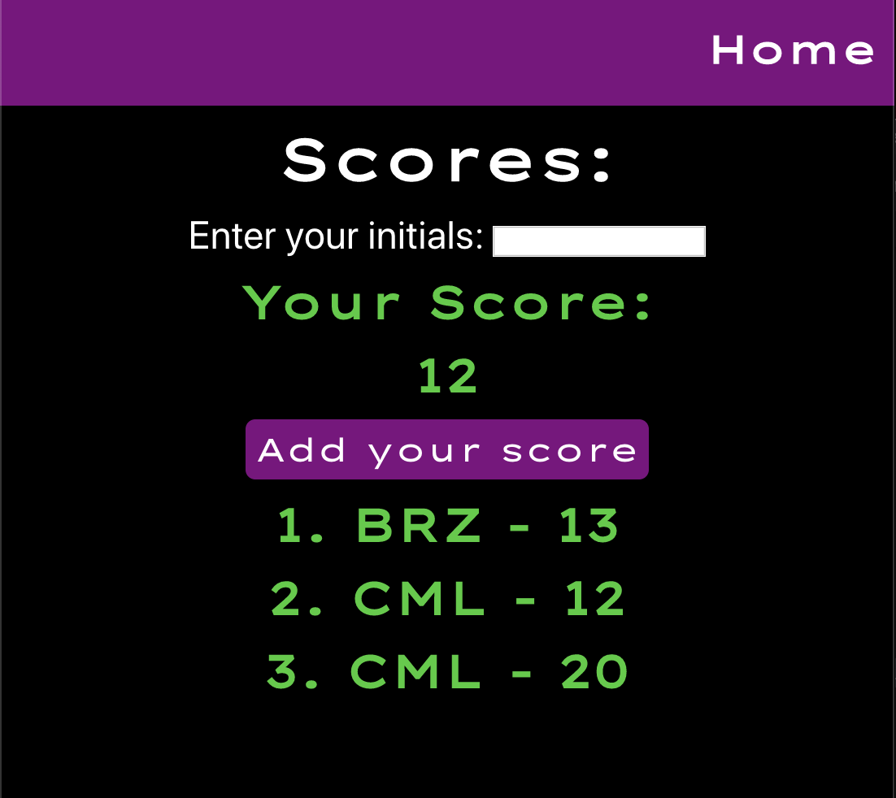

# Match Maker

## Live Link
- [Match Maker Game](https://match-maker.christinamlabay.now.sh/)

## Summary
The user will flip two cards at a time, and if they are a match, the cards will stay flipped.
If not, they will flip back over.

## Screenshots:

###Landing Page: 

A brief description and the entry to the game.

### Game Page:

The player will select two cards at a time, trying to find matches. The game can be reset by clicking the reset button.

### Scores Page:

Here, the player can enter their score, and see how they match up with other players.

## Technologies Used
* JavaScript
* React 
* Node
* Express
* Postgres

## Available Scripts

In the project directory, you can run:

### `npm start`

Runs the app in the development mode. 
Open [http://localhost:3000](http://localhost:3000) to view it in the browser.

The page will reload if you make edits. 
You will also see any lint errors in the console.

### `npm test`

Launches the test runner in the interactive watch mode. 
See the section about [running tests](https://facebook.github.io/create-react-app/docs/running-tests) for more information.

### `npm run build`

Builds the app for production to the `build` folder. 
It correctly bundles React in production mode and optimizes the build for the best performance.

The build is minified and the filenames include the hashes. 
Your app is ready to be deployed!

See the section about [deployment](https://facebook.github.io/create-react-app/docs/deployment) for more information.
